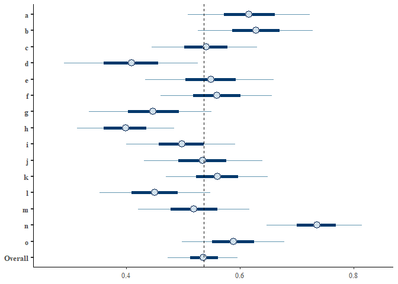
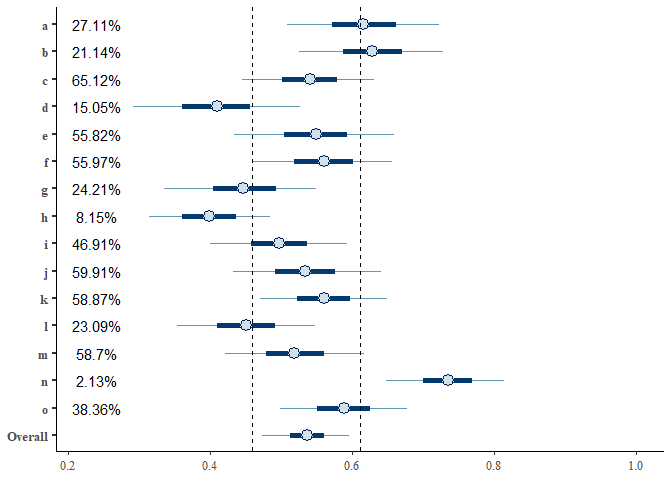

Bayesian GLMM For Hospital Monitoring
================
Andrew Johnson
18/02/2022

## Prep

First we’ll load the packages we need, and prepare some previous
generated data for use:

``` r
library(tidyverse)
# Package for Bayesian modelling
library(brms)
# Package for plotting Bayesian results
library(bayesplot)

data <- read.csv("demo_data.csv") %>%
  group_by(hospital) %>%
  summarise(across(c(numerator, denominator), sum))

knitr::kable(head(data))
```

| hospital | numerator | denominator |
|:---------|----------:|------------:|
| a        |        25 |          38 |
| b        |        32 |          48 |
| c        |        34 |          63 |
| d        |        11 |          33 |
| e        |        21 |          38 |
| f        |        29 |          51 |

## Estimate Bayesian GLMM

``` r
PR_model = 
  # brm is the workhorse function which estimates the specified model
  # Here we specify that we have proportion data with numerators and
  # denominators, and these are clustered within hospitals
  brm(numerator | trials(denominator) ~ 1 + (1 | hospital), data, 
      # The family function is essential to ensure that the right model is
      # applied to the dataset
      family = binomial(),
      # These parameters are for optimising performance, don't worry about them
      # for now
      normalize = FALSE, backend = "cmdstanr", cores = 4,
      # Suppress printing output progress
      silent = 2, refresh = 0)
```

    ## Running MCMC with 4 parallel chains...
    ## 
    ## Chain 4 finished in 0.7 seconds.
    ## Chain 1 finished in 0.8 seconds.
    ## Chain 2 finished in 0.8 seconds.
    ## Chain 3 finished in 0.8 seconds.
    ## 
    ## All 4 chains finished successfully.
    ## Mean chain execution time: 0.8 seconds.
    ## Total execution time: 1.2 seconds.

## Extract Results

Because we have specified a random intercept for each hospital
(`(1 | hospital)`), the model will estimate the average proportion, as
well as the amount that the individual ‘true’ proportions will vary
around that. So the next step is to extract the overall ‘average’
proportion, as well as the estimate ‘true’ proportions for each hospital

``` r
intcpts = 
  # Extract group-specific proportions
  coef(PR_model, summary = FALSE)[[1]][,,1] %>%
  data.frame() %>%
  mutate(
    # Extract overall proportion
    Overall = fixef(PR_model, summary=FALSE)[,1],
    # Back-convert from logit scale to proportion scale
    across(everything(), ~inv_logit_scaled(.))
  )
```

## Plotting Results

### Base Plot

Next we’ll use the `bayesplot` package to graphically depict the ranges
of values that our hospital’s ‘true’ proportions can take:

``` r
plt = mcmc_intervals(intcpts)

plt
```

<!-- -->

This plot shows the observed average proportion for each hospital (the
blue circle), as well as 95% of the range of values that the hospital’s
‘true’ proportion could take (95% credibility intervals). For hospitals
with large denominators (many observations) we have more information to
support our decision-making, so the range is narrower. For smaller
sites, we have more uncertainty.

You’ll also notice that the overall proportion has credibility
intervals. This captures the fact that the ‘true’ statewide average
might be different from what we’ve observed, so we have an additional
level of uncertainty around that. Let’s add a line indicating the state
average to the plot, to make it easier to see which hospitals might be
outlying:

``` r
plt + geom_vline(xintercept = mean(intcpts$Overall), linetype = "dashed")
```

<!-- -->

Here we can clearly see several hospitals whose 95% credibility
intervals don’t contain the state average.

### Additional Information

To add some additional contextual information to the plot, we can also
estimate the probability that a given hospital has the same ‘true’
proportion as the state average. We do this by comparing the posterior
distribution of a given hospital’s estimated proportion, to that of the
state average and estimating the proportion that overlap:

(This section is a bit more niche and advanced so don’t worry too much
about following the code)

``` r
props = sapply(grep("Overall", colnames(intcpts), value=T, invert=T),
               function(x){
                 overlapping::overlap(list(intcpts[,x], intcpts[,"Overall"]),
                                      nbins=5000)$OV}) %>%
  data.frame() %>%
  rename(prop = '.') %>%
  rownames_to_column(var="group") %>%
  mutate(prop = paste0(round(prop * 100, 2),"%")) %>%
  rbind(., c("Overall","")) %>%
  mutate(group = str_remove(group, ".Y1-Y2"),
         group = factor(group, levels = levels(plt$data$parameter)))
```

### Combining Everything

Finally, we add those probabilities to our plot and inspect the results:

``` r
# Extract x-axis minimum
xmin = layer_scales(plt)$x$range$range[1]

# Extract 95% Credibility Intervals for Overall Proportion
limits = inv_logit_scaled(fixef(PR_model,probs=c(0.025,0.975)))[3:4]

# Add proportions to base plot, and rescale x-axis to fit
plt = plt + 
        xlim(xmin-0.07,1) + 
        geom_text(data=props,aes(y=group,x=xmin-0.05,label=prop)) +
        geom_vline(xintercept = limits, linetype="dashed")
plt
```

<!-- -->
