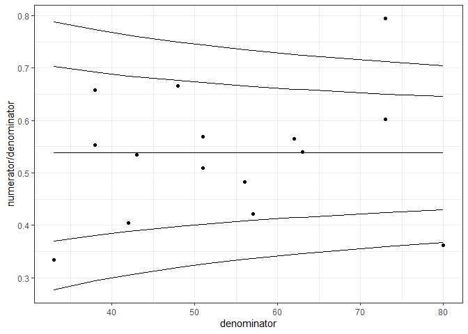

HQIU Funnel Plots
================
Andrew Johnson
28/01/2022

# Preparing Input Data

When monitoring hospitals using funnel plots, we work with aggregates
over a given time period (e.g., a month). So while we may have multiple
observations for a given hospital, we will first aggregate them before
constructing a funnel plot.

For example, consider the following input data

``` r
raw_data <- read.csv("demo_data.csv")

knitr::kable(head(raw_data, n = 10))
```

| hospital | date       | numerator | denominator |
|:---------|:-----------|----------:|------------:|
| a        | 2020-01-01 |         5 |           8 |
| a        | 2020-01-01 |         9 |          10 |
| a        | 2020-01-01 |         0 |           3 |
| a        | 2020-01-01 |         3 |           4 |
| a        | 2020-01-01 |         8 |          13 |
| b        | 2020-02-01 |        10 |          14 |
| b        | 2020-02-01 |         0 |           1 |
| b        | 2020-02-01 |         5 |           9 |
| b        | 2020-02-01 |        12 |          13 |
| b        | 2020-02-01 |         5 |          11 |

The data has multiple observations for a given hospital within a given
time period, and so we first need to aggregate. We use the ‘tidyverse’
suite of packages and coding style, and so to aggregate we would do the
following:

``` r
# Load all tidyverse packages
library(tidyverse)
```

    ## -- Attaching packages --------------------------------------- tidyverse 1.3.1 --

    ## v ggplot2 3.3.5     v purrr   0.3.4
    ## v tibble  3.1.6     v dplyr   1.0.8
    ## v tidyr   1.2.0     v stringr 1.4.0
    ## v readr   2.1.2     v forcats 0.5.1

    ## -- Conflicts ------------------------------------------ tidyverse_conflicts() --
    ## x dplyr::filter() masks stats::filter()
    ## x dplyr::lag()    masks stats::lag()

``` r
# The 'pipe' operator (%>%) specifies that the current data should be passed to
#  the next operation
agg_data = raw_data %>%
    # The 'group' function specifies that the following operations should
    #   should be applied to each group separately
    group_by(hospital) %>%
    # The 'summarise' function indicates that a single value (for each group)
    #  will be returned from any functions, rather than a value for each input
    #
    # The 'across' function is used for applying a transformation to multiple
    #   variables, in this case, summing the numerator and denominator
    summarise(across(c(numerator, denominator), sum)) %>%
    # Ungroup the returned aggregates, to avoid any unexpected behaviour in the
    #   future
    ungroup()
```

Which now gives us the following:

``` r
knitr::kable(agg_data)
```

| hospital | numerator | denominator |
|:---------|----------:|------------:|
| a        |        25 |          38 |
| b        |        32 |          48 |
| c        |        34 |          63 |
| d        |        11 |          33 |
| e        |        21 |          38 |
| f        |        29 |          51 |
| g        |        17 |          42 |
| h        |        29 |          80 |
| i        |        27 |          56 |
| j        |        23 |          43 |
| k        |        35 |          62 |
| l        |        24 |          57 |
| m        |        26 |          51 |
| n        |        58 |          73 |
| o        |        44 |          73 |

# Funnel Plots for Proportions

To generate funnel plot limits for proportion data, we need to use a
normal approximation. In other words, we have to use a method that
approximately treats the proportion data as normal, continuous, data so
that we can use normal-data methods.

The method we use is called the ‘inverse-sine’ or ‘arcsine’ method. This
involves first taking the square-root of the proportion, and then taking
the arcsine of that proportion. In other words, if we define the
numerator as

and the denominator as
,
the arcsine transformation for a given observation is:


")

This transforms the data to something that approximately resembles a
normal distribution, and so we can use normal-data approach to
constructing funnel plot limits. The normal-data approach to funnel plot
limits requires both a Mean and a Standard Error (SE), where the
standard error is derived as a function of the number of observations
(size of the denominator). To derive the mean (target line) for
proportion data, we use the overall proportion (sum of all numerators
divided by the sum of all denominators):


And apply the transformation to that:


")

The standard error for a given observation is then given by:


Next, we’ll add these to our dataset:

``` r
plot_data <- agg_data %>%
  # Use the 'mutate' function to add new columns to data
  mutate(p = sum(numerator) / sum(denominator),
         target = asin(sqrt(p)),
         se = 1 / (2 * sqrt(denominator)))

knitr::kable(plot_data)
```

| hospital | numerator | denominator |         p |    target |        se |
|:---------|----------:|------------:|----------:|----------:|----------:|
| a        |        25 |          38 | 0.5383663 | 0.8238022 | 0.0811107 |
| b        |        32 |          48 | 0.5383663 | 0.8238022 | 0.0721688 |
| c        |        34 |          63 | 0.5383663 | 0.8238022 | 0.0629941 |
| d        |        11 |          33 | 0.5383663 | 0.8238022 | 0.0870388 |
| e        |        21 |          38 | 0.5383663 | 0.8238022 | 0.0811107 |
| f        |        29 |          51 | 0.5383663 | 0.8238022 | 0.0700140 |
| g        |        17 |          42 | 0.5383663 | 0.8238022 | 0.0771517 |
| h        |        29 |          80 | 0.5383663 | 0.8238022 | 0.0559017 |
| i        |        27 |          56 | 0.5383663 | 0.8238022 | 0.0668153 |
| j        |        23 |          43 | 0.5383663 | 0.8238022 | 0.0762493 |
| k        |        35 |          62 | 0.5383663 | 0.8238022 | 0.0635001 |
| l        |        24 |          57 | 0.5383663 | 0.8238022 | 0.0662266 |
| m        |        26 |          51 | 0.5383663 | 0.8238022 | 0.0700140 |
| n        |        58 |          73 | 0.5383663 | 0.8238022 | 0.0585206 |
| o        |        44 |          73 | 0.5383663 | 0.8238022 | 0.0585206 |

To generate control limits using these values, we need to use the
critical values of the standard normal
():


Commonly, 2 & 3 are used as the critical values for the 95% and 99%
limits, respectively (e.g., 3 SD). However, these are slightly off, and
it is more precise to use the `qnorm` function in R:

``` r
a99 <- qnorm(.999)  # 3.090232....
a95 <- qnorm(.975)  # 1.959964...
```

So now that we have the target value, standard error, and critical
values, we can add the control limits for each observation to our
dataset:

``` r
plot_data <- plot_data %>%
  mutate(ll99_trans = target - a99 * se,
         ul99_trans = target + a99 * se,
         ll95_trans = target - a95 * se,
         ul95_trans = target + a95 * se)

knitr::kable(head(plot_data))
```

| hospital | numerator | denominator |         p |    target |        se | ll99\_trans | ul99\_trans | ll95\_trans | ul95\_trans |
|:---------|----------:|------------:|----------:|----------:|----------:|------------:|------------:|------------:|------------:|
| a        |        25 |          38 | 0.5383663 | 0.8238022 | 0.0811107 |   0.5731513 |    1.074453 |   0.6648282 |   0.9827763 |
| b        |        32 |          48 | 0.5383663 | 0.8238022 | 0.0721688 |   0.6007839 |    1.046821 |   0.6823540 |   0.9652505 |
| c        |        34 |          63 | 0.5383663 | 0.8238022 | 0.0629941 |   0.6291359 |    1.018469 |   0.7003361 |   0.9472684 |
| d        |        11 |          33 | 0.5383663 | 0.8238022 | 0.0870388 |   0.5548321 |    1.092772 |   0.6532093 |   0.9943952 |
| e        |        21 |          38 | 0.5383663 | 0.8238022 | 0.0811107 |   0.5731513 |    1.074453 |   0.6648282 |   0.9827763 |
| f        |        29 |          51 | 0.5383663 | 0.8238022 | 0.0700140 |   0.6074427 |    1.040162 |   0.6865773 |   0.9610272 |

However, there’s one more step we need to complete before plotting.
Currently, the control limits are in the transformed scale (arcsine
transformed), but for ease of interpretability, we want to
back-transform the limits to the proportion scale. To do this, we just
need to apply the opposite transformations in the reverse order (i.e.,
sine and square, rather than arcsine and square-root):

)^2
")

Which we complete in R as:

``` r
plot_data <- plot_data %>%
  mutate(ll99 = sin(ll99_trans)^2,
         ul99 = sin(ul99_trans)^2,
         ll95 = sin(ll95_trans)^2,
         ul95 = sin(ul95_trans)^2)

knitr::kable(head(plot_data))
```

| hospital | numerator | denominator |         p |    target |        se | ll99\_trans | ul99\_trans | ll95\_trans | ul95\_trans |      ll99 |      ul99 |      ll95 |      ul95 |
|:---------|----------:|------------:|----------:|----------:|----------:|------------:|------------:|------------:|------------:|----------:|----------:|----------:|----------:|
| a        |        25 |          38 | 0.5383663 | 0.8238022 | 0.0811107 |   0.5731513 |    1.074453 |   0.6648282 |   0.9827763 | 0.2940703 | 0.7732210 | 0.3805951 | 0.6922916 |
| b        |        32 |          48 | 0.5383663 | 0.8238022 | 0.0721688 |   0.6007839 |    1.046821 |   0.6823540 |   0.9652505 | 0.3195520 | 0.7496734 | 0.3976837 | 0.6759989 |
| c        |        34 |          63 | 0.5383663 | 0.8238022 | 0.0629941 |   0.6291359 |    1.018469 |   0.7003361 |   0.9472684 | 0.3462691 | 0.7247211 | 0.4153477 | 0.6590574 |
| d        |        11 |          33 | 0.5383663 | 0.8238022 | 0.0870388 |   0.5548321 |    1.092772 |   0.6532093 |   0.9943952 | 0.2775188 | 0.7883766 | 0.3693456 | 0.7029640 |
| e        |        21 |          38 | 0.5383663 | 0.8238022 | 0.0811107 |   0.5731513 |    1.074453 |   0.6648282 |   0.9827763 | 0.2940703 | 0.7732210 | 0.3805951 | 0.6922916 |
| f        |        29 |          51 | 0.5383663 | 0.8238022 | 0.0700140 |   0.6074427 |    1.040162 |   0.6865773 |   0.9610272 | 0.3257778 | 0.7438823 | 0.4018213 | 0.6720396 |

We are now ready to construct the plot itself. For this we use `ggplot2`

``` r
# Add hospital to the 'label' attribute so that they're included in the tooltips
fpl <- ggplot(plot_data, aes(x=denominator, y=numerator/denominator,
                             label = hospital)) +
  geom_point() +
  geom_line(aes(y=p)) +
  geom_line(aes(y=ll99)) +
  geom_line(aes(y=ll95)) +
  geom_line(aes(y=ul95)) +
  geom_line(aes(y=ul99)) +
  theme_bw()

fpl
```

<!-- -->
